由于本课程20级采用开卷考，因此本文档主要总结重点知识点：

1.嵌入式课程与计算机组成，操作系统相互联系，主要知识点在另外两门课程均有接触（如：处理器 存储）等，考试中题目通常以嵌入式~~~为提纲（如：嵌入式处理器，嵌入式操作系统），因此请同学们复习注意区分常规知识与嵌入式的区别和联系。

2.重点章节：2.2嵌入式系统硬件组成 各种封装的名字和特点 
           3.2嵌入式处理器类型及特点 ***
           3.3 ARM MIPS架构
           4.2 存储器分类及特性
           5.2 复位电路 ***
           5.4 电路的抖动和消抖
           6.1 总线（重点查看各类总线的功能和特点）
           8.1 微内核 超微内核架构
           8.2 实时 与内核服务机制
           10.1 轮转结构 前后台软件结构 函数队列调度结构
           10.2 中段 数据共享 **
           10.3 软件设计机制 ***可重入式代码，看门狗方式

3. 考试题目 主要以选择题，概念题为主，可能有判断题和编程题(19级)

4.

5.一些重要概念（题目）：对关键名词和概念熟悉知道在那个章节（若开卷）
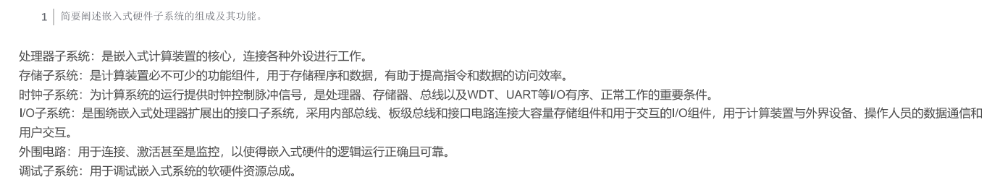

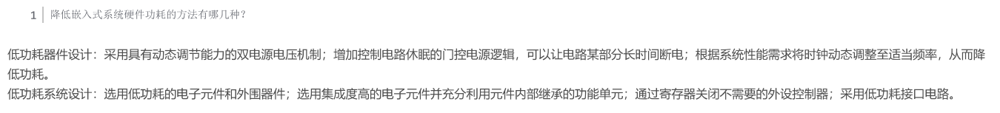

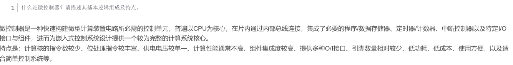

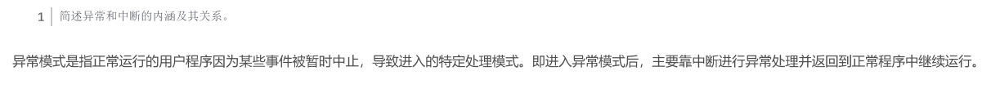

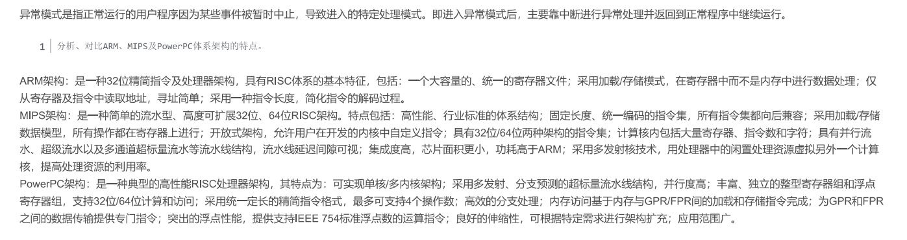

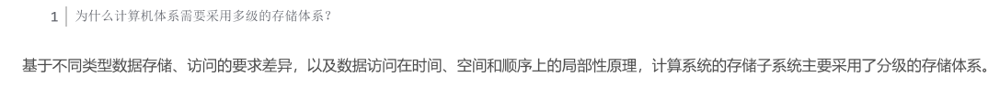

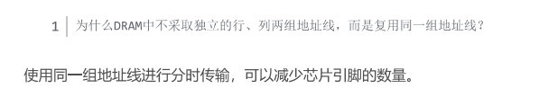

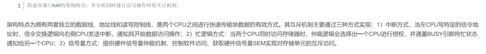

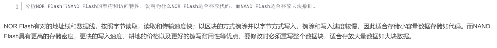

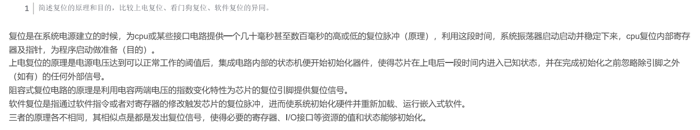

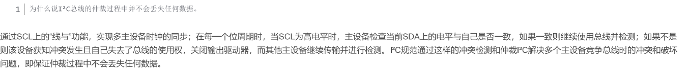

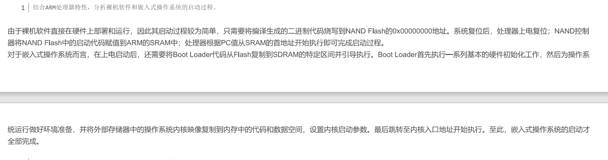

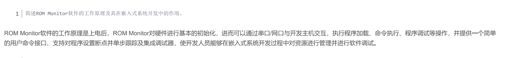

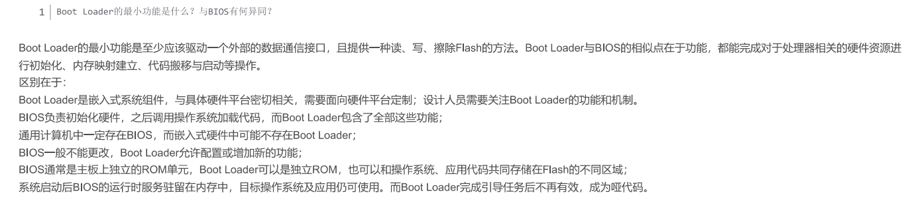

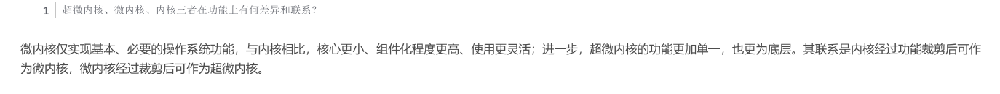

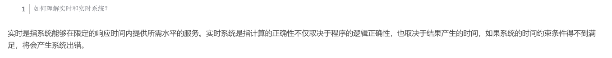

1. 19级试卷：自行查阅正确答案【利用chatGPT】
-1.jpg)
